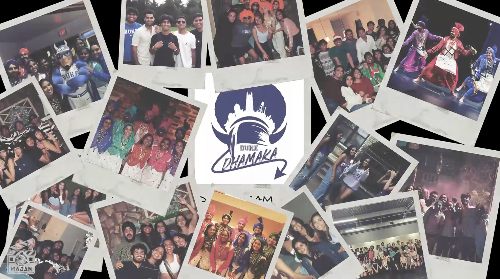

 # $\textsf{\color{skyblue} Duke Dhamaka Intro Video 2025 (Derby City Dhoom)}$

## $\textsf{\color{lightgreen} Description}$
This project was an introduction video for Duke Dhamaka, Duke University’s premier competitive bhangra team. The video was played before our performance at Cerby City Dhoom 2025 at University of Louisville. It is designed to introduce the team members and set the energetic and vibrant mood for our performance. Duke Dhamaka is known for its dynamic and powerful bhangra routines, competing in national competitions and headlining major events such as Duke's Centennial Event and Awaaz.

## $\textsf{\color{lightgreen} Video}$
  

   
  

## $\textsf{\color{lightgreen} Editing Software Used}$
- Adobe Premiere Pro
- Panzoid
- Adobe Photoshop

## $\textsf{\color{lightgreen} Cameras Used}$
- iPhone 15 Pro
- Canon EOS 90D
